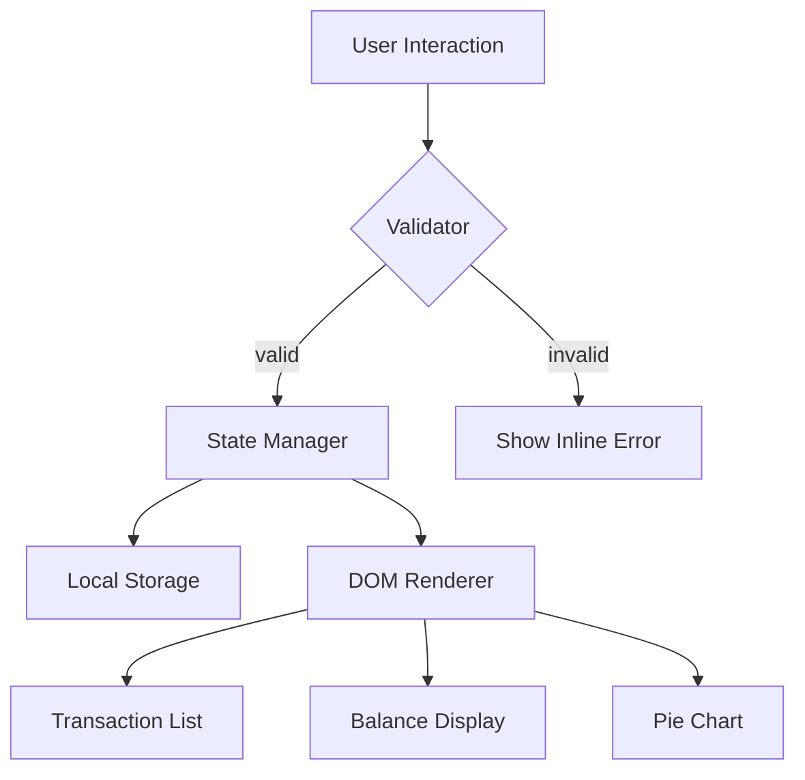

# Design Document: Expense & Budget Visualizer

## Overview

The Expense & Budget Visualizer is a fully client-side single-page web application built with plain HTML, CSS, and Vanilla JavaScript. It requires no backend, no build tools, and no external frameworks. All data is persisted in the browser's Local Storage.

The app allows users to:
- Add expense transactions (name, amount, category)
- Delete transactions
- View a running total balance
- See a pie chart of spending by category

The architecture is intentionally minimal: one HTML file, one CSS file, and one JavaScript file. The JS file is organized into logical modules (functions/objects) for state management, DOM manipulation, validation, storage, and chart rendering.

---

## Architecture

The app follows a simple **unidirectional data flow**:

```
User Action → Validator → State Update → Local Storage → DOM Re-render
```



All application state lives in a single in-memory array (`transactions`). Every mutation (add/delete) goes through the state manager, which:
1. Updates the in-memory array
2. Persists to Local Storage
3. Triggers a full re-render of all UI components

This "re-render everything" approach is appropriate for the small data sizes expected and keeps the logic simple and correct.

### File Structure

```
/
├── index.html
├── css/
│   └── styles.css
└── js/
    └── app.js
```

---

## Components and Interfaces

### 1. Input Form (`InputForm`)

Responsible for collecting user input and triggering transaction creation.

**DOM Elements:**
- `#item-name` — text input for item name
- `#amount` — number input for amount
- `#category` — `<select>` with options: Food, Transport, Fun
- `#add-btn` — submit button
- `.error-msg` — inline error display spans

**Interface (functions in `app.js`):**
```js
getFormValues() → { name: string, amount: string, category: string }
resetForm() → void
showFormError(field: string, message: string) → void
clearFormErrors() → void
```

### 2. Validator

Pure logic — no DOM access. Validates raw form values before they become transactions.

```js
validateTransaction({ name, amount, category }) → { valid: boolean, errors: { field: string, message: string }[] }
```

Rules:
- `name`: must be non-empty (after trimming)
- `amount`: must be a finite number greater than 0
- `category`: must be one of `['Food', 'Transport', 'Fun']`

### 3. State Manager

Holds the canonical in-memory state and coordinates updates.

```js
// Internal state
let transactions = []  // Array<Transaction>

addTransaction(transaction: Transaction) → void
deleteTransaction(id: string) → void
getTransactions() → Transaction[]
getTotalBalance() → number
getSpendingByCategory() → { Food: number, Transport: number, Fun: number }
```

### 4. Storage Module

Wraps Local Storage access.

```js
saveTransactions(transactions: Transaction[]) → void
loadTransactions() → Transaction[]
```

### 5. Transaction List Renderer

Renders the `#transaction-list` DOM element.

```js
renderTransactionList(transactions: Transaction[]) → void
```

- If `transactions` is empty, renders a placeholder message
- Each item shows: name, amount, category, and a delete button with `data-id` attribute

### 6. Balance Display Renderer

Updates `#balance-display`.

```js
renderBalance(total: number) → void
```

### 7. Pie Chart Renderer

Draws the pie chart onto a `<canvas>` element using the Canvas 2D API (no external chart library).

```js
renderChart(spendingByCategory: { Food: number, Transport: number, Fun: number }) → void
```

- If all values are zero, renders an empty-state placeholder text on the canvas
- Uses fixed colors: Food → `#FF6384`, Transport → `#36A2EB`, Fun → `#FFCE56`
- Draws a legend below the chart

### 8. App Controller

The top-level orchestrator. Wires event listeners and coordinates all modules.

```js
init() → void          // Called on DOMContentLoaded
handleAddTransaction() → void
handleDeleteTransaction(id: string) → void
renderAll() → void     // Calls all three renderers
```

---

## Data Models

### Transaction

```js
{
  id: string,        // UUID-like string, e.g. crypto.randomUUID() or Date.now().toString()
  name: string,      // Item name, non-empty
  amount: number,    // Positive number
  category: 'Food' | 'Transport' | 'Fun'
}
```

### AppState (in-memory)

```js
{
  transactions: Transaction[]
}
```

### Local Storage Schema

- Key: `"expense-visualizer-transactions"`
- Value: JSON-serialized `Transaction[]`

```js
// Save
localStorage.setItem("expense-visualizer-transactions", JSON.stringify(transactions))

// Load
JSON.parse(localStorage.getItem("expense-visualizer-transactions") || "[]")
```

---

## Correctness Properties

*A property is a characteristic or behavior that should hold true across all valid executions of a system — essentially, a formal statement about what the system should do. Properties serve as the bridge between human-readable specifications and machine-verifiable correctness guarantees.*

### Property 1: Validator rejects all invalid inputs

*For any* combination of inputs where the item name is empty or whitespace-only, the amount is non-positive or non-numeric, or the category is not one of the valid options, the validator should return invalid and identify the offending fields.

**Validates: Requirements 1.4, 1.5**

### Property 2: Adding a transaction grows the list

*For any* existing transaction list and any valid transaction, after calling `addTransaction`, the resulting list should contain exactly one more element and that element should have the same name, amount, and category as the added transaction.

**Validates: Requirements 1.2**

### Property 3: Deletion removes exactly one transaction

*For any* list of transactions containing a transaction with a given id, after calling `deleteTransaction` with that id, the resulting list should have exactly one fewer element and should contain no transaction with that id.

**Validates: Requirements 3.2, 3.3**

### Property 4: Balance equals sum of amounts

*For any* array of transactions (including the empty array), `getTotalBalance()` should equal the arithmetic sum of all transaction amounts in that array (and zero for the empty array).

**Validates: Requirements 4.1, 4.2, 4.3, 4.4**

### Property 5: Spending by category sums to total balance

*For any* array of transactions, the sum of all values returned by `getSpendingByCategory()` should equal `getTotalBalance()`, and any category with no transactions should have a value of zero.

**Validates: Requirements 5.1, 5.2, 5.3, 5.4**

### Property 6: Local Storage round-trip

*For any* array of valid transaction objects, calling `saveTransactions` followed by `loadTransactions` should return an array that is deeply equal to the original (same ids, names, amounts, and categories in the same order).

**Validates: Requirements 6.1, 6.2, 6.3**

### Property 7: Transaction list renders all required fields and delete control

*For any* non-empty array of transactions, the output of `renderTransactionList` should contain each transaction's name, amount, and category, and a delete control with the transaction's id as a data attribute.

**Validates: Requirements 2.1, 3.1**

---

## Error Handling

| Scenario | Handling |
|---|---|
| Empty item name | Validator blocks submission; inline error shown next to name field |
| Non-positive or non-numeric amount | Validator blocks submission; inline error shown next to amount field |
| Missing category selection | Validator blocks submission; inline error shown next to category field |
| Local Storage unavailable (e.g. private browsing quota) | `try/catch` around storage calls; app continues in-memory only, no crash |
| Local Storage contains malformed JSON | `try/catch` around `JSON.parse`; falls back to empty array |
| Delete called with unknown id | State manager no-ops silently; no crash |

---

## Testing Strategy

### Unit Tests

Focus on pure logic modules that have no DOM dependency:

- **Validator**: test all valid/invalid combinations for name, amount, and category
- **State Manager**: test `addTransaction`, `deleteTransaction`, `getTotalBalance`, `getSpendingByCategory` with various transaction arrays
- **Storage Module**: test serialize/deserialize round-trip with mock `localStorage`

### Property-Based Tests

Use **fast-check** (JavaScript property-based testing library) with a minimum of 100 iterations per property.

Each property test is tagged with a comment referencing the design property:
> `// Feature: expense-budget-visualizer, Property N: <property_text>`

Properties to implement:

| Property | Test Description |
|---|---|
| P1: Validator rejects all invalid inputs | Generate invalid name/amount/category combinations, verify validator returns invalid with correct error fields |
| P2: Adding a transaction grows the list | Generate random valid transactions and existing lists, call addTransaction, verify list length +1 and entry presence |
| P3: Deletion removes exactly one transaction | Generate random lists with a known id, call deleteTransaction, verify count -1 and id absence |
| P4: Balance equals sum of amounts | Generate random transaction arrays, compare `getTotalBalance()` to `array.reduce((s,t) => s + t.amount, 0)` |
| P5: Spending by category sums to total balance | Generate random transaction arrays, verify sum of `getSpendingByCategory()` values equals `getTotalBalance()` |
| P6: Local Storage round-trip | Generate random transaction arrays, save then load, verify deep equality |
| P7: Transaction list renders all required fields | Generate random non-empty transaction arrays, call renderTransactionList, verify name/amount/category and delete control present for each |

### Integration / Smoke Tests

- Open `index.html` in each target browser (Chrome, Firefox, Edge, Safari) and verify:
  - Form renders with all three fields
  - Adding a transaction updates list, balance, and chart
  - Deleting a transaction updates list, balance, and chart
  - Refreshing the page restores all transactions from Local Storage
  - Empty state shows placeholder messages in list and chart

### Performance

- Manual verification: add/delete transactions and confirm UI updates feel instantaneous (target < 100ms)
- No automated performance tests required given the simplicity of the data set
