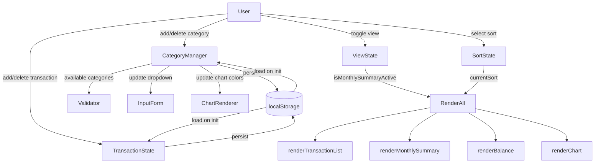

# Design Document

## expense-visualizer-enhancements

---

## Overview

This document describes the technical design for three incremental enhancements to the Expense & Budget Visualizer — a client-side-only application written in plain HTML, CSS, and Vanilla JavaScript with no build tooling.

The three enhancements are:

1. **Custom Categories** — users can add and delete their own spending categories beyond the three defaults (Food, Transport, Fun).
2. **Monthly Summary View** — a toggleable view that groups and totals transactions by calendar month/year.
3. **Sort Transactions** — a sort control above the transaction list offering four sort orders.

All changes remain within the existing technology constraints: no frameworks, no build tools, `localStorage` as the only persistence mechanism, and `fast-check` (via Vitest) for property-based testing.

---

## Architecture

The codebase already has a clean split between pure logic (`js/logic.js`) and DOM-oriented app code (`js/app.js`). This split is preserved and extended:

```
js/logic.js   — pure functions, no DOM, no localStorage: all new business logic lives here
js/app.js     — DOM wiring, event handlers, renderers: enhanced to support new UI states
css/styles.css — small additions for new UI controls
index.html    — minimal structural additions (category manager section, toggle button, sort control)
```

The overall rendering flow remains `renderAll()` → `renderTransactionList | renderBalance | renderChart`. New state variables (`currentSort`, `isMonthlySummaryActive`) are held in memory in `app.js` and are not persisted.

### Data flow diagram



---

## Components and Interfaces

### 1. Category Manager

Responsible for the canonical list of available categories (defaults + custom).

**New `localStorage` key:** `expense-visualizer-categories`  
Stores only the custom categories as a JSON array of strings (e.g. `["Rent","Gym"]`). Default categories are never written to storage — they are always merged in at runtime.

**New pure functions in `logic.js`:**

```js
// Load custom categories from storage; merge with defaults to produce full list
loadCategories(storage): string[]

// Persist custom categories (excludes defaults) to storage
saveCategories(storage, allCategories: string[]): void

// Add a new custom category; returns { ok, error }
addCategory(currentCategories: string[], newName: string): { ok: boolean, categories?: string[], error?: string }

// Delete a category; returns { ok, error }
deleteCategory(currentCategories: string[], name: string): { ok: boolean, categories?: string[], error?: string }

// Validate a category name before adding
validateCategoryName(currentCategories: string[], name: string): { valid: boolean, error?: string }
```

**DOM additions (index.html):**
- A new `<section class="categories-section">` with:
  - An `<input id="new-category-input">` and `<button id="add-category-btn">`
  - A `<ul id="category-list">` that renders each custom category with a Delete button
  - An `<span class="error-msg" data-field="category-name">` for inline errors

**`validateTransaction` change:** The validator must accept a dynamic `validCategories` array instead of referencing the module-level `VALID_CATEGORIES` constant. Signature becomes:

```js
validateTransaction({ name, amount, category }, validCategories: string[]): { valid, errors }
```

**`getSpendingByCategory` change:** Instead of returning a hardcoded `{Food:0, Transport:0, Fun:0}` object, it now accepts the full categories list and builds the result dynamically:

```js
getSpendingByCategory(transactions: Transaction[], categories: string[]): Record<string, number>
```

### 2. Monthly Summary View

A toggled view rendered into the same `#transaction-list` container that replaces the standard list while active.

**Toggle state:** A boolean `isMonthlySummaryActive` in `app.js` (not persisted).

**New pure function in `logic.js`:**

```js
// Groups transactions by "Month YYYY" and returns sorted groups
groupByMonth(transactions: Transaction[]): MonthGroup[]

// MonthGroup shape:
// { label: string, total: number, transactions: Transaction[] }
```

Grouping key is derived from the transaction's `createdAt` ISO string:
```js
const d = new Date(tx.createdAt);
const label = d.toLocaleString('default', { month: 'long', year: 'numeric' }); // "April 2025"
```

Groups are returned newest-month-first; transactions within each group are in chronological order (oldest first within the month).

**DOM additions (index.html):**
- A `<button id="toggle-view-btn">` in the `.list-section` header area. Text toggles between "Monthly Summary" and "All Transactions".

**`renderAll` change:** Calls either `renderTransactionList` or `renderMonthlySummary` based on `isMonthlySummaryActive`. The sort control `<select>` is hidden while monthly summary is active (CSS class toggle or `display:none`).

### 3. Sort Transactions

A `<select id="sort-control">` rendered above `#transaction-list`, hidden in monthly summary mode.

**Sort state:** A string `currentSort` in `app.js`, one of:
- `'newest'` (default) — by `createdAt` descending
- `'amount-asc'` — by amount ascending
- `'amount-desc'` — by amount descending
- `'category-az'` — by category name A–Z (case-insensitive)

**New pure function in `logic.js`:**

```js
sortTransactions(transactions: Transaction[], sort: SortKey): Transaction[]
```

Returns a new array (no mutation). Sorting is stable: when two transactions compare equal on the primary key, their relative order from the original array is preserved.

**`createdAt` field:** `addTransactionToList` gains an optional `timestampFn` parameter (defaults to `() => new Date().toISOString()`) so tests can inject a fixed timestamp. Legacy transactions loaded from storage that lack `createdAt` fall back to `'1970-01-01T00:00:00.000Z'` for sort stability.

---

## Data Models

### Transaction (updated)

```ts
interface Transaction {
  id: string;           // crypto.randomUUID()
  name: string;         // trimmed, non-empty
  amount: number;       // positive float
  category: string;     // must be in current categories list
  createdAt: string;    // ISO 8601 date string, e.g. "2025-04-20T14:32:00.000Z"
}
```

### MonthGroup

```ts
interface MonthGroup {
  label: string;        // "April 2025"
  total: number;        // sum of transaction amounts in this month
  transactions: Transaction[];  // sorted chronologically within the month
}
```

### SortKey

```ts
type SortKey = 'newest' | 'amount-asc' | 'amount-desc' | 'category-az';
```

### Category Storage

- `localStorage` key `expense-visualizer-transactions` — unchanged format; gains `createdAt` on new entries.
- `localStorage` key `expense-visualizer-categories` — JSON array of custom category name strings only:

```json
["Rent", "Gym", "Subscriptions"]
```

### Color Palette for Custom Categories

A fixed ordered palette is defined in `app.js` (render layer, not logic):

```js
const CUSTOM_COLORS = [
  '#4BC0C0', '#9966FF', '#FF9F40', '#C9CBCF',
  '#E7E9ED', '#71B37C', '#F77825', '#D62728'
];
```

Custom categories are assigned colors by their index in the custom categories array (modulo palette length). This mapping is computed at render time — not persisted.

---

## Correctness Properties

*A property is a characteristic or behavior that should hold true across all valid executions of a system — essentially, a formal statement about what the system should do. Properties serve as the bridge between human-readable specifications and machine-verifiable correctness guarantees.*

### Property 1: Duplicate category names are rejected (case-insensitive)

*For any* non-empty list of existing categories and any string that is a case-insensitive match for an existing category name, `addCategory` SHALL return `{ ok: false }` with an error message and leave the category list unchanged.

**Validates: Requirements 1.3**

### Property 2: Custom category add/delete is a round trip

*For any* list of categories and a valid new category name (non-empty, not a duplicate), adding that category and then deleting it SHALL produce a category list equal to the original.

**Validates: Requirements 1.2, 1.6**

### Property 3: Category storage round trip preserves defaults

*For any* set of custom categories, calling `saveCategories` followed by `loadCategories` SHALL return a list that contains all three Default_Categories (Food, Transport, Fun) plus all the saved custom categories, with no other additions.

**Validates: Requirements 1.1, 1.8**

### Property 4: Default categories cannot be deleted

*For any* category list and any target name drawn from {Food, Transport, Fun}, `deleteCategory` SHALL return `{ ok: false }` with an error message and return the original list unchanged.

**Validates: Requirements 1.7**

### Property 5: Validator accepts and rejects based on current category list

*For any* current category list and any category string, `validateTransaction` SHALL return `valid: true` for the category field if and only if the category string is present in the current list (exact match).

**Validates: Requirements 1.1, 1.5**

### Property 6: `getSpendingByCategory` sums to total balance

*For any* transaction list and any categories array, the sum of all values returned by `getSpendingByCategory` SHALL equal the value returned by `getTotalBalance` for the same transaction list.

**Validates: Requirements 2.2**

### Property 7: `groupByMonth` is exhaustive, non-overlapping, and chronologically ordered within groups

*For any* transaction list, `groupByMonth` SHALL return groups such that:
- The union of all transactions across all groups contains exactly the same set of transactions as the input (no additions, no omissions, no duplicates).
- Each transaction appears in the group whose label matches the `Month YYYY` of that transaction's `createdAt` field.
- Within each group, transactions are in chronological order (`createdAt` ascending).

**Validates: Requirements 2.1, 2.3**

### Property 8: `groupByMonth` group totals equal the sum of amounts in each group

*For any* transaction list, for every group returned by `groupByMonth`, the `total` field SHALL equal the arithmetic sum of `amount` across all transactions in that group.

**Validates: Requirements 2.2**

### Property 9: `sortTransactions` is a permutation

*For any* transaction list and any `SortKey`, `sortTransactions` SHALL return an array that contains exactly the same elements as the input (a permutation): same length, no duplicates, no omissions.

**Validates: Requirements 3.1, 3.2, 3.3, 3.4**

### Property 10: `sortTransactions` produces correctly ordered output

*For any* transaction list, `sortTransactions` SHALL satisfy the following pairwise ordering invariants for each consecutive pair `(a, b)` in the result:
- `'amount-asc'`: `a.amount <= b.amount`
- `'amount-desc'`: `a.amount >= b.amount`
- `'category-az'`: `a.category.toLowerCase() <= b.category.toLowerCase()`
- `'newest'`: `a.createdAt >= b.createdAt`

**Validates: Requirements 3.1, 3.2, 3.3, 3.4**

---

## Error Handling

| Scenario | Handling |
|---|---|
| `addCategory` with empty/whitespace name | Return `{ ok: false, error: 'Category name is required.' }`; show inline error |
| `addCategory` with duplicate name (case-insensitive) | Return `{ ok: false, error: 'Category already exists.' }`; show inline error |
| `deleteCategory` targeting a default category | Return `{ ok: false, error: 'Default categories cannot be deleted.' }`; show inline error |
| `localStorage` quota exceeded (categories) | Catch silently; in-memory state still updated |
| `localStorage` malformed JSON (categories) | `loadCategories` returns `[]` (custom) merged with defaults |
| Transaction with missing `createdAt` (legacy data) | Treated as `'1970-01-01T00:00:00.000Z'` for sort/grouping — sorts to end of "newest" list |
| `groupByMonth` with empty transaction list | Returns `[]`; renderer shows placeholder message |

---

## Testing Strategy

### Unit / Example-based tests

- `validateCategoryName`: empty string, whitespace-only, duplicate (exact and case-insensitive), valid new name
- `addCategory` / `deleteCategory`: happy path and each error branch
- `groupByMonth`: empty list → `[]`; single month; two months in correct order; transactions within month in chronological order
- `sortTransactions`: empty list returns `[]`; single item; already-sorted input; reverse-sorted input

### Property-based tests (fast-check, 100 runs each)

Each property below maps to a numbered Correctness Property above.

| Test | Property | fast-check strategy |
|---|---|---|
| Duplicate category rejection | Property 1 | Generate existing list + pick name from it + vary case |
| Add/delete round trip | Property 2 | Generate category list + valid new name |
| Category storage round trip | Property 3 | Generate custom category array; save → load; assert defaults present |
| Default categories undeletable | Property 4 | `fc.constantFrom('Food','Transport','Fun')` as target |
| Dynamic validator accepts/rejects | Property 5 | Generate categories list; draw category inside vs. outside the list |
| `getSpendingByCategory` sums to total | Property 6 | Generate transaction list + matching categories array |
| `groupByMonth` exhaustiveness + ordering | Property 7 | Generate transaction list with random ISO `createdAt` values |
| `groupByMonth` group totals | Property 8 | Same generator as Property 7 |
| `sortTransactions` is permutation | Property 9 | Generate transaction list × `fc.constantFrom(...SortKeys)` |
| `sortTransactions` ordering | Property 10 | Same generator; assert pairwise ordering invariant per sort key |

All property tests follow the tag format:
`Feature: expense-visualizer-enhancements, Property N: <property_text>`

PBT is appropriate here because all new logic functions are pure functions with clear input/output behavior operating over arrays of objects — input variation meaningfully exercises edge cases (empty arrays, single elements, equal sort keys, same-month grouping, etc.).
